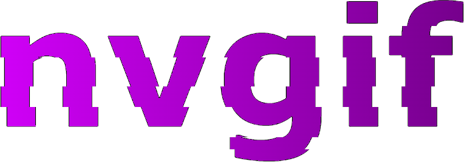

# This is version 4 of the Not Very Good Image Format 

NVGIF is a tiny, simple image format designed for fun, experimentation, and learning. Despite its tongue‑in‑cheek name, NVGIF is only slightly larger than PNG on average, and it comes with clear specs and **3(!)** reference implementations. As it has so many implementations, that basically proves it's a standard.

Version 4 introduces refinements to compression (RLE + zlib), making decoding more efficient while keeping the format lightweight and approachable.

## File Extensions and Mimetype

The MIME type of NVGIF files is `image/x-nvgif`

| Extension | Versions Supported | Notes |
|-----------|--------------------|-------|
| `.nvg`    | v1–v4              | General extension, recommended for everyday use |
| `.nvg1`   | v1                 | Explicit version marker (optional) |
| `.nvg2`   | v2                 | Explicit version marker (optional) |
| `.nvg3`   | v3                 | Explicit version marker (optional) |
| `.nvg4`   | v4                 | Explicit version marker (optional) |

## Reference Implementations

The Github repo contains 3 reference implementations of NVGIF:

- **Python (`python/nvgif.py`)** 🐍  
  Requires `pillow`. Provides an `NVGIF` class with `.encode` and `.decode` methods.  
  Supports all versions (v1-v4).

- **JavaScript (`nvgif.js`)** 🌐  
  Browser decoder. Finds `` and `<picture>` elements with NVGIF sources and replaces them with decoded PNGs via [Blob URIs](https://en.wikipedia.org/wiki/Blob_URI_scheme). Also has an `NVGIFImage` with `.onload` and `.onerror` so that you can draw images onto a canvas.
  Supports all versions (v1-v4, decode-only). Uses [`pako`](https://github.com/nodeca/pako) via jsDelivr for v4 compression. Example in [`nvgifjstest.html`](nvgifjstest.html).

- **C# (`csharp/NVGIF.cs`)** ⚙️  
  Requires `System.Drawing.Common`. Provides an `NVGIF` class with `.Decode` method.  
  Supports all versions (v1–v4, decode-only). Example in [`csharp/NVGIFTest.cs`](https://github.com/tiash-and-cats/nvgif/tree/master/csharp).

Detailed API docs are in [NVGIF Implementations](implementations.md).

## Specification

The specification is in [`specs/`](specs/).

## NVGIF CLI Tool

A standalone NVGIF encoder/decoder is available as a command-line utility. It supports version-aware encoding, decoding, and header inspection across all NVGIF versions.

It is located in the `python/` directory in the Github repo as [`nvgif_cli.py`](https://github.com/tiash-and-cats/nvgif/tree/master/python/nvgif_cli.py). As it uses the Python implementation of NVGIF, it needs Pillow to function. You need Python >=3.12 to run it.

This tool is ideal for scripting, testing, or integrating NVGIF into your own pipelines.

### Example Usage

Encode a PNG file into NVGIF v4:
```bash
python nvgif-cli.py encode input.png output.nvg --version 4
```

Convert an `.nvg` file back into a standard PNG:
```bash
python nvgif-cli.py decode input.nvg output.png
```

Display an NVGIF file's header and metadata:
```bash
python nvgif-cli.py info input.nvg
```

View an NVGIF image in a resizable window:
```bash
python nvgif-cli.py view image.nvg
```
> Launches a graphical window with the image rendered over a checkerboard background (for transparency). Handy for previewing `.nvg` files without converting to PNG.

For more options, run:
```bash
python nvgif-cli.py --help
```